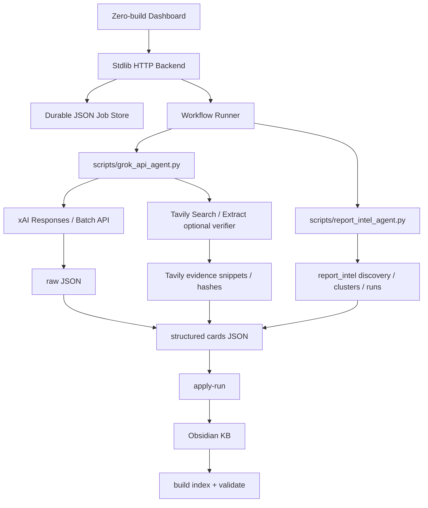

# Grok KB Agent Suite Architecture

## 对标 GitHub 前沿 Agent 的口碑特质

| 特质 | 代表项目/实践 | 本项目落地 |
|---|---|---|
| Durable execution | LangGraph 的 durable execution / resume | `data/jobs/*.json` 持久化 job；API run 输出落盘 |
| Human-in-the-loop | LangGraph / Mastra workflow suspend/resume | 默认 dry-run；apply-run 和 validate 分离 |
| Structured output | PydanticAI type-safe output；OpenAI/xAI JSON schema | `scripts/grok_api_agent.py` 使用 JSON Schema |
| Observability | Mastra observability/evals；OpenAI Agents tracing | `manifest.json`, `usage.tsv`, raw response, stdout/stderr tail |
| Tool registry | OpenAI Agents SDK tools；MCP-first frameworks | suite-local `skills/powerups/*.skill.md` |
| Minimal magic | 社区实践：raw API + JSON state 可维护性更强 | 后端只用 Python stdlib，关键流程显式 subprocess |
| QA gates | Agent eval/guardrail common pattern | build index + validate，之后可加 source check sample |

## 高层结构



## 为什么不直接套重框架

当前任务是高度确定的 ETL/curation workflow，不需要一开始引入 LangGraph/CrewAI/AutoGen 的全部复杂度。口碑好的生产 Agent 项目共同点不是“框架越重越好”，而是：

1. 状态可恢复。
2. 工具边界清楚。
3. 输出可验证。
4. 运行可观察。
5. 人类可审查。
6. 失败可重试。

因此 v1 选择 stdlib + JSON state + Grok API；后续如果需要 DAG、分支、暂停恢复，可以把 `workflows.py` 替换成 LangGraph/Mastra，而不影响前端和 KB 写入层。

## Agent 角色

- **Planner**：把 topic 或 batch 范围转成可执行 job。
- **Source Finder**：调用 `x_search` / `web_search` 做 2025-2026 情报发现。
- **Tavily Verifier**：对非 X web URL 做 Extract；对缺失来源/低置信/冲突卡做 Search 候选发现。
- **Prompt Compressor**：压缩 batch prompt，去 DOM 噪声，保持关键字段。
- **Structured Expander**：用 JSON Schema 输出 KB card。
- **Boundary Sanitizer**：把高误触表达转为授权/Lab/合成数据语境。
- **KB Writer**：写入 Obsidian KB 的独立 section。
- **QA Gate**：索引重建、validate、source sampling。
- **Cost Observer**：记录 usage 和 cost ticks。
- **Report Intelligence**：公开披露报告发现、聚类、摘要化分析、报告写作/impact 学习。

## API

- `GET /api/health`
- `GET /api/skills`
- `GET /api/jobs`
- `GET /api/jobs/<id>`
- `POST /api/jobs`

`POST /api/jobs` body：

```json
{ "action": "expand", "from_batch": 11, "to_batch": 12, "use_search": true, "dry_run": true }
```

支持 action：

- `expand`
- `discover`
- `batch_submit`
- `apply_run`
- `validate`
- `tavily_verify`
- `report_discover`
- `report_cluster`
- `report_enrich`
- `report_apply`

## 后续升级路线

1. SQLite job store 替代 JSON files。
2. WebSocket/SSE 实时日志。
3. Source verifier 自动抽样打开 URL。
4. Cost budget cap：超过预算自动 pause。
5. Evals：随机抽样评分 source fidelity / transferability / boundary quality。
6. MCP server：把 KB search、run creation、source verification 暴露为工具。
7. LangGraph mode：复杂长期任务用 graph state + checkpoint。

## Evidence-first Update（2026-05-05）

为降低 Grok 搜索幻觉，Agent Suite 现在把 evidence baseline 作为硬性入口条件：

1. System prompt 和 user prompt 同时包含证据基线。
2. 每个 batch item 附带已有 KB excerpt 与 sha256 摘要。
3. JSON Schema 强制返回 `verification_status`、`verification_summary`、`conflict_notes`、`evidence`。
4. `unchanged_verification_only` 不重复旧内容，只写核查结果。
5. `needs_review` 必须 confidence=low，并说明缺失证据。

这相当于把“生成卡片”升级为“source-backed verification + conditional update”。

## Tavily Verifier Update（2026-05-05）

新增 Tavily 为可选独立校验层：

1. `--tavily-preverify`：在构造 Grok expansion prompt 前，对普通 web source URL 做 Extract，并把短 snippet/hash 加入 `ITEMS_JSON.tavily_context`。
2. `--tavily-context`：在 Discovery 前增加 Tavily Search 结果，作为 web 候选来源上下文。
3. `tavily-verify-run`：对 `cards/*.json` 做后处理，默认只核查 `needs_review`、冲突、低置信、缺来源卡片。
4. `apply-run`：若 card JSON 带有 `tavily_verification`，落库到 `## Evidence / 核查元数据`。
5. X/Twitter URL 默认跳过 Tavily Extract，避免把 web 搜索结果误当作原生 X 证据。

## Report Intelligence Update（2026-05-06）

新增公开报告情报链路：

1. `report_discover`：公开来源优先，收集 HackerOne disclosed/Hacktivity、Bugcrowd CrowdStream、GitHub Security Lab/GHSA、研究员博客、X 讨论和 newsletter 候选。
2. `report_cluster`：按 canonical URL、平台 report id、GHSA id、title+program+vuln_class 去重。
3. `report_enrich`：用 Tavily Extract 做 web 来源核查，再用 Grok structured output 生成 report cards。
4. `report_apply`：写入 `docs/intelligence_kb/reports/*`，更新 `data/report_intel/report_ledger.tsv` 和 report index。
5. 默认只保存摘要/链接/证据短片段/hash，不保存完整正文，不处理未披露或登录墙内容。

## Report Source Catalog Update（2026-05-08）

新增 source catalog 层，后端动作扩展为：

- `report_catalog_build`：生成 `data/report_intel/source_catalog.json` 与 `docs/intelligence_kb/reports/source_catalog.md`。
- `report_discover_source`：按单个 `source_id` 采集。
- `report_discover_catalog`：按 tier/preset 批量采集，支持 `maximum_coverage`、`public_only`、`paid_authorized`、`gray_metadata_only`、`web3_reports`。
- `report_import_manual`：导入用户确认拥有合法使用权的付费/私域 export。
- `report_triage_sources`：按可靠度、学习价值、法律风险、可自动采集性排序渠道。

架构约束：

1. 自动采集只面向公开网页、公开 API、公开 GitHub repo、公开 newsletter archive 和公开报告目录。
2. 付费/私域内容只通过用户授权导出导入；仍只保存摘要、链接、证据短片段/hash。
3. 灰色 report trade 只生成 `channel_metadata`，进入 watchlist，不进入 cluster/enrich/apply。

## Manual Channel Research Update（2026-05-08）

新增合法付费/私域/小众渠道发现记录层：

1. `manual-channel-prompts` 生成 6 个 Grok Expert 调研 prompt。
2. `import-manual-channel-results` 导入 TSV/JSONL，并自动分流为合法入口与 redacted leads。
3. `validate-discovery-records` 阻断私邀、直接付款页、附件 URL、云盘、盗版/泄露关键词和疑似全文。
4. `apply-manual-channel-catalog` 将合法入口追加到 source catalog，并保留 `manual_acquisition_method`、`entry_type`、`requires_auth/payment/vetting`。
5. `export-manual-channel-index` 生成 `manual_channel_sources.md`，按合法入口、已屏蔽入口、待复核组织。
