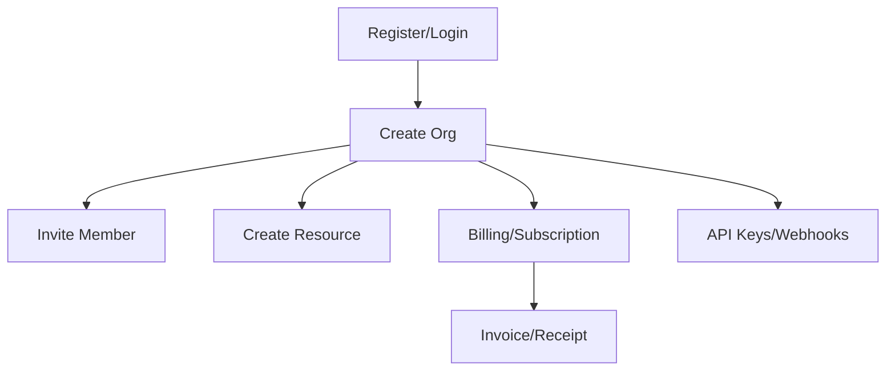

---
# Machine-readable target metadata (consumed by Phase 3 match.py)
program: ""           # 例 acme-bug-bounty / shopify-public
platform: ""          # hackerone | bugcrowd | intigriti | yeswehack | self-hosted | cn-src
scope_url: ""
reward_range: ""      # 例 "$200 - $30000"
last_updated: ""      # YYYY-MM-DD

# 技术栈与攻击面信号 — 用于 intel-target 匹配
tech_stack: []        # 例 [react, nodejs, fastapi, rails]
cdn: []               # 例 [cloudflare, fastly, akamai]
edge: []              # 例 [nginx, traefik, kong, envoy]
iac: []               # 例 [terraform, pulumi, cloudformation]
cicd: []              # 例 [github-actions, gitlab-ci, argocd, jenkins]
cloud_provider: []    # 例 [aws, gcp, azure, alibaba]
mobile_app_id: []     # 例 [com.acme.android, 1234567890 (iOS App Store id)]
auth_stack: []        # 例 [auth0, okta, custom-jwt, saml-keycloak]
data_stores: []       # 例 [postgres, mongodb, redis, elasticsearch]
graphql: false        # true / false
web3: false
ai_features: false
payment: false        # 是否处理真实支付
multi_tenant: false

# 项目 RoE 信号
automation_allowed: false
payment_testing_allowed: false
test_accounts_allowed: false
account_self_serve: false
---

# Target Dossier Template

## 基本信息

- Program:
- Platform:
- Scope URL:
- Reward range:
- Triage speed:
- Last updated:
- Automation allowed:
- Payment testing allowed:
- Test accounts allowed:

## Scope

### In scope

```text

```

### Out of scope

```text

```

### Third-party / do-not-touch

```text

```

## 业务模型

- 用户类型：guest / user / admin / org owner / merchant / partner / support
- 核心资源：user / org / project / invoice / subscription / payment method / API key / webhook
- 敏感动作：invite / export / refund / cancel / role change / integration / token rotation

## 高价值流程图



## 历史报告与已知重复区

| 链接 | 类型 | 影响 | 可迁移点 | 重复风险 |
|---|---|---|---|---|

## 自动化输入

- Config file: `config/scope.<program>.json`
- Last recon run:
- Interesting diffs:

## 手工测试计划

- [ ] Auth/session
- [ ] Access control / IDOR
- [ ] Tenant boundary
- [ ] API params
- [ ] OAuth/SSO/JWT
- [ ] GraphQL
- [ ] Billing/payment/business logic
- [ ] Webhook/integrations
- [ ] Export/import/files

## 当前假设

1.
2.
3.

## 下一步

- [ ]
- [ ]
- [ ]
