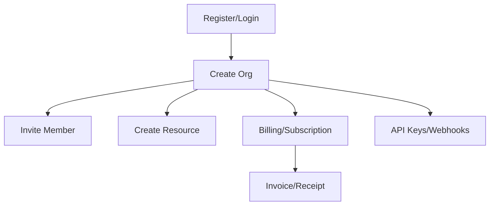

# Target Dossier Template

## 基本信息

- Program:
- Platform:
- Scope URL:
- Reward range:
- Triage speed:
- Last updated:
- Automation allowed:
- Payment testing allowed:
- Test accounts allowed:

## Scope

### In scope

```text

```

### Out of scope

```text

```

### Third-party / do-not-touch

```text

```

## 业务模型

- 用户类型：guest / user / admin / org owner / merchant / partner / support
- 核心资源：user / org / project / invoice / subscription / payment method / API key / webhook
- 敏感动作：invite / export / refund / cancel / role change / integration / token rotation

## 高价值流程图



## 历史报告与已知重复区

| 链接 | 类型 | 影响 | 可迁移点 | 重复风险 |
|---|---|---|---|---|

## 自动化输入

- Config file: `config/scope.<program>.json`
- Last recon run:
- Interesting diffs:

## 手工测试计划

- [ ] Auth/session
- [ ] Access control / IDOR
- [ ] Tenant boundary
- [ ] API params
- [ ] OAuth/SSO/JWT
- [ ] GraphQL
- [ ] Billing/payment/business logic
- [ ] Webhook/integrations
- [ ] Export/import/files

## 当前假设

1.
2.
3.

## 下一步

- [ ]
- [ ]
- [ ]
